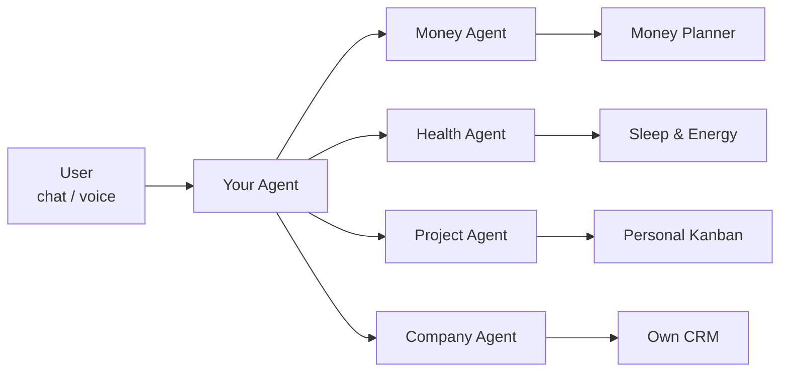

# OS7 Site Slides

This document describes the content slides for the OS7 website.

The goal is not to define final visual design. The goal is to define the story, message, and product proof each screen must communicate.

## Language Rule

Write the specification, notes, rationale, and implementation guidance in English.

The live website is English-first. Russian text may exist only as archived exploration or translation reference, not as current website copy.

## Core Narrative

OS7 is not another chatbot and not another generic SaaS.

The core idea:

```text
Chat is for intent.
Apps are for memory, structure, visualization, and action.
AI builds the apps.
```

Earlier Russian framing:

```text
Чат нужен, чтобы выразить намерение.
Приложения нужны, чтобы хранить, структурировать и показывать данные.
ИИ создает эти приложения под человека или компанию.
```

The site should move the visitor through this story:

1. People and companies do not need another fixed SaaS tool.
2. They need software shaped around how they live or work.
3. A chat is a good place to express intent, but a bad place to keep long-term systems.
4. OS7 turns intent into applications, databases, dashboards, and workflows.
5. Those applications become the user's personal or company operating surface.

## Slide 1: Hero

### Goal

Immediately explain what OS7 is and show that it creates real software, not just answers in chat.

### Main Message

```text
Build your
own OS with AI
```

Alternative:

```text
Build your
company OS with AI
```

### Supporting Copy

```text
Describe how you live or work. OS7 will create apps, databases, dashboards, and workflows, then adapt them to you or your company with voice control and chat.
```

### Audience-Specific First-Screen Copy

Personal copy:

```text
You do not need to search for separate apps for habits, finances, health, learning, and projects. Describe your goal, and OS7 will create a system where your data can be stored, seen, and used.
```

Company copy:

```text
You do not need to assemble your company from separate SaaS tools for CRM, finance, requests, documents, reports, and approvals. Describe how the company works, and OS7 will create a system where data can be stored, seen, and used.
```

### Prompt Field Behavior

The hero product signal should be simple: one prompt field, not a fake system simulation.

Prompt field label:

```text
Describe the operating system
```

Generated result label:

```text
Generating by AI
```

Show a small spinner next to `Generating by AI`. Keep this as the only active-system signal in the hero header; do not reintroduce runtime logs, build sessions, or fake orchestration events.

Each generated app card may show a thin, quiet fake progress bar to imply generation in progress. The bar should be translucent gray, slowly fill once over roughly 5 seconds, and then stop. Do not add progress bars to the `and more ...` row. Respect `prefers-reduced-motion`.

Generated program examples for personal mode:

```text
Money Planner
Sleep & Energy
Personal Kanban
Nutrition Log
Family Hub
Trip Planner
Gift & Event Planner
and more ...
```

Generated program examples for company mode:

```text
Own CRM
Invoicing Hub
Project Board
Analytics & Reports
Email Campaigns
Team Workflows
Inventory & Orders
and more ...
```

The prompt field cycles through five examples for the selected audience mode. Each prompt is typed, held briefly, deleted, and replaced by the next prompt.

Do not show runtime logs, build sessions, progress bars, fake modules, or orchestration status in the first slide.

Timing used in the current implementation:

- typing: `32ms` per character
- pause after full prompt: `850ms`
- deleting: `14ms` per character

Respect `prefers-reduced-motion`: when reduced motion is enabled, show the first prompt without typing/deleting animation.

Personal prompt examples:

```text
I want to get my health under control
I want to stop losing money without knowing where it goes
I want to build a daily routine and not quit after one week
I want to move into a new career in six months
I want to organize my documents and important life admin
```

Company prompt examples:

```text
I want to digitize my company
I want to see customers, requests, and next actions in one place
I want to understand payments, debt, and cashflow one month ahead
I want approvals to stop living in chats and spreadsheets
I want to see the state of the company every week without manual reports
```

### Primary CTA

```text
Build your system
```

### Product Proof To Show

The first screen should stay simple:

- audience switcher
- headline
- primary CTA
- prompt field with rotating examples
- `Generating by AI`
- generated app names with icons and subtle one-time progress bars

### Visitor Takeaway

```text
I describe what I need, and OS7 turns it into a working system.
```

## Slide 2: Problem

### Goal

Explain why OS7 needs to exist before showing the system mechanics.

The problem is not simply "chat is bad" or "SaaS is bad." The deeper problem is that life and work are fragmented across too many tools, while custom software has historically been too expensive for most people and teams.

### Main Message

```text
Your life and work are scattered across tools that were not built for you.
```

Alternative:

```text
People and companies are forced to adapt to software instead of software adapting to them.
```

### Supporting Copy

```text
Habits live in one app. Finances in another. Health data somewhere else. Company work is split across CRM, invoices, spreadsheets, chats, documents, reports, and internal tools. The data exists, but the system does not.
```

### Problem Points

- too many separate apps
- data gets trapped in each tool
- workflows move through chat, spreadsheets, and memory
- dashboards rarely match the real process
- changing software is slow and expensive
- generic SaaS forces people and teams into fixed workflows
- chat can express intent, but it cannot hold a durable operating system by itself

### Personal Version

```text
You should not need a separate app for every part of life.
You need one system shaped around your goals, routines, data, and decisions.
```

### Company Version

```text
Your company should not be assembled from disconnected SaaS tools.
You need software that matches how the company actually works.
```

### Product Proof To Show

Current visual direction:

- left: headline and supporting copy
- right: three problem cards:
  - `Too many separate apps`
  - `Data gets trapped inside each tool`
  - `Changing software is slow and expensive`
- bottom/right: missing layer card: `A custom operating system`

Keep this slide simple and conceptual. It should create tension, not explain the full solution.

### Visitor Takeaway

```text
The old model makes people and companies adapt to fragmented tools. OS7 exists because AI makes custom software possible at a much lower cost.
```

## Slide 3: App Library, Vibe Coding, And Subagents

### Goal

Show how OS7 works after the first promise: it starts from a library of AI-built applications, installs them into the user's own environment, lets the user modify them through vibe coding, and lets subagents operate them.

This slide should make OS7 feel more concrete and technically credible without turning into an architecture diagram.

### Main Message

```text
Start from AI-built apps. Make them yours.
```

Alternative:

```text
Install AI-built apps, adapt them with vibe coding, and operate them with subagents.
```

### Supporting Copy

```text
OS7 starts with a library of ready-made applications built by AI. Install the apps you need on your own server, adapt them through vibe coding, and let subagents operate each app through chat, voice, and tools.
```

### Core Idea

```text
AI does not have to generate everything from an empty page.
It can start from a library of useful apps, install them, modify them, and operate them for you.
```

### Flow

```text
AI-built app library
  -> install on your server
  -> adapt with vibe coding
  -> connect data and workflows
  -> operate through subagents
```

### Agent/App Model

The second slide should include a simple system diagram.

Core model:

```text
Your Agent
  -> subagents
  -> apps
```

The main agent is the user's control layer. It receives the user's intent through chat or voice, then routes work to specialized subagents. Each subagent is connected to one app and understands that app's tools, data model, and workflows.

Mermaid diagram:



### Diagram Meaning

- The user does not operate every app manually.
- The user talks to one main agent.
- The main agent coordinates specialized subagents.
- Each subagent can operate one app deeply.
- Apps can be installed from the AI-built app library.
- Apps can later be modified through vibe coding.

Possible slide copy:

```text
Your agent coordinates specialized subagents.
Each subagent operates an app.
```

Alternative copy:

```text
One agent to control your system.
Subagents to operate each app.
Apps to handle each part of life or work.
```

### App Library Examples

Personal apps:

```text
Money Planner
Sleep & Energy
Personal Kanban
Nutrition Log
Family Hub
Trip Planner
Gift & Event Planner
```

Company apps:

```text
Own CRM
Invoicing Hub
Project Board
Analytics & Reports
Email Campaigns
Team Workflows
Inventory & Orders
```

### Install On Your Server

The site should communicate ownership and control:

- the app is not just a demo
- the app can run in the user's environment
- the app can have its own database
- the app can store durable data
- the app can be changed over time

Possible copy:

```text
Install each app into your own OS7 environment with its own data, workflows, and permissions.
```

### Modify With Vibe Coding

Vibe coding means the user describes the product change in natural language, and AI edits the app.

Example prompts:

```text
Add a family budget view to Money Planner
Turn this project board into a weekly planning system
Add approval steps to the invoice workflow
Create a dashboard for overdue customer requests
```

Possible copy:

```text
Describe what should change. OS7 edits the app, updates the interface, and adapts the workflow.
```

### Operate Through Subagents

Each app can have a subagent that understands its data, tools, and workflow.

Examples:

- Money agent manages budgets, subscriptions, and cashflow
- Health agent reviews sleep, energy, nutrition, and routines
- CRM agent updates customers, deals, and follow-ups
- Finance agent tracks invoices, payments, and overdue accounts
- Operations agent routes requests, approvals, and tasks

Possible copy:

```text
Every app can have its own subagent. Ask the agent to update data, generate reports, run workflows, or change the app itself.
```

### Product Proof To Show Later

Current site visualization:

- left side: title, supporting copy, and three chips: `App library`, `Vibe coding`, `Subagents`
- right side: one `Your Agent` card connected conceptually to four subagent cards
- each subagent card contains one app card
- no database layer

Possible future visual directions:

- left: app library grid
- middle: selected app installing into "your server"
- right: vibe coding prompt and subagent controls

or:

- top: library of apps
- bottom: one selected app moving through `Install -> Modify -> Operate`

### Visitor Takeaway

```text
OS7 is not just a prompt-to-app demo. It is a library of AI-built apps that can be installed, customized, and operated by agents.
```

## Slide 4: Chat Is Not Enough

### Goal

Explain the problem without attacking chat as a concept. Chat is useful for intent, but weak as a long-term interface.

### Main Message

```text
Чат хорош для намерения. Но система не должна жить в переписке.
```

### Supporting Copy

```text
В чате удобно сказать: "хочу привести финансы в порядок", "хочу отслеживать здоровье", "хочу оцифровать компанию". Но данные, таблицы, статусы, процессы и отчеты быстро тонут в сообщениях.
```

### Points

- данные теряются в истории сообщений
- таблицы и базы неудобно вести в переписке
- дашборды и отчеты сложно возвращать к жизни каждую неделю
- workflow трудно запускать, проверять и повторять
- состояние системы сложно увидеть одним взглядом
- через месяц непонятно, где находится рабочая версия процесса

### Product Proof To Show

Contrast between:

- a chat thread full of buried requests
- a structured OS7 surface with apps, tables, dashboards, and workflows

### Visitor Takeaway

```text
Chat is the starting point, not the final interface.
```

## Slide 5: The OS7 Principle

### Goal

State the product philosophy in one simple model.

### Main Message

```text
Намерение превращается в приложение.
```

### Supporting Copy

```text
OS7 берет описание цели или процесса и создает под него структуру: данные, интерфейс, дашборды, действия и связи с другими приложениями.
```

### Flow

```text
User describes goal or process
  -> AI designs the data model
  -> AI creates the app
  -> AI deploys it
  -> user starts using it
  -> data accumulates
  -> AI improves and connects apps over time
```

### Product Proof To Show

Show the generation pipeline:

- intent
- schema
- app
- dashboard
- workflow
- deployed system

### Visitor Takeaway

```text
OS7 does not just answer. It builds the place where the answer becomes useful over time.
```

## Slide 6: Audience Switch

### Goal

Show that the same core product works for two contexts: a person and a company.

### Main Message

```text
Одна идея. Два режима.
```

### Controls

```text
Для тебя | Для компании
```

### Supporting Copy

```text
У человека жизнь разбросана по привычкам, здоровью, финансам, обучению, заметкам и проектам. У компании работа разбросана по CRM, счетам, заявкам, складу, документам и внутренним таблицам.
```

```text
В обоих случаях проблема одна: человеку или команде нужен не универсальный SaaS, а система, которая совпадает с реальной жизнью или работой.
```

### Product Proof To Show

The same cockpit changes based on the selected mode:

- personal mode shows health, habits, sleep, finance, learning, projects
- company mode shows CRM, requests, invoices, inventory, HR, reports, approvals

### Visitor Takeaway

```text
OS7 can become either my personal operating system or my company's operating system.
```

## Slide 7A: For You

### Goal

Make the personal version concrete.

### Main Message

```text
OS7 собирает приложения вокруг твоей жизни.
```

### Supporting Copy

```text
Не нужно искать отдельные приложения под привычки, финансы, здоровье, обучение и проекты. Опиши цель, а OS7 создаст систему, где данные можно хранить, видеть и использовать.
```

### Example Prompt

```text
Хочу взять здоровье под контроль.
```

### Quality-Of-Life Requests

Use these as concrete examples of what people actually ask for and what OS7 can create.

#### Health And Energy

User request:

```text
Хочу понять, почему я постоянно уставший, и постепенно вернуть энергию.
```

OS7 creates:

- sleep tracker
- energy journal
- symptom log
- nutrition and caffeine tracker
- workout and recovery plan
- weekly health review
- charts for sleep, mood, energy, and activity

#### Habits And Routine

User request:

```text
Хочу выстроить нормальный режим дня и перестать все бросать через неделю.
```

OS7 creates:

- habit tracker
- morning and evening routine planner
- streak and consistency dashboard
- friction log
- weekly adjustment flow
- reminders and check-ins
- habit experiment history

#### Personal Finance

User request:

```text
Хочу перестать терять деньги непонятно куда и накопить на подушку безопасности.
```

OS7 creates:

- income and expense tracker
- budget dashboard
- subscription tracker
- debt payoff plan
- savings goal tracker
- monthly cashflow report
- spending anomaly alerts

#### Learning And Career

User request:

```text
Хочу за полгода перейти в новую профессию и не потеряться в материалах.
```

OS7 creates:

- learning roadmap
- course and resource database
- weekly study plan
- skill progress tracker
- project portfolio board
- spaced repetition system
- interview preparation dashboard

#### Mental Clarity And Reflection

User request:

```text
Хочу лучше понимать, что со мной происходит, и принимать решения спокойнее.
```

OS7 creates:

- reflection journal
- mood tracker
- decision log
- triggers and patterns dashboard
- weekly self-review
- therapy notes organizer
- values and goals map

#### Personal Projects

User request:

```text
У меня много идей и проектов, но все лежит в заметках и никуда не движется.
```

OS7 creates:

- project dashboard
- idea inbox
- task board
- milestone tracker
- weekly planning flow
- resource library
- progress reports

#### Documents And Life Admin

User request:

```text
Хочу наконец навести порядок в документах, счетах, страховках и важных делах.
```

OS7 creates:

- document vault
- renewal and deadline tracker
- insurance and contract database
- important contacts list
- payment and obligation calendar
- life admin dashboard
- search interface for personal records

#### Relationships And Social Life

User request:

```text
Хочу не терять связь с важными людьми и лучше помнить, что происходит в их жизни.
```

OS7 creates:

- relationship CRM
- important dates tracker
- conversation notes
- follow-up reminders
- gift and preference database
- family and friends dashboard
- social energy planner

#### Home And Family

User request:

```text
Хочу, чтобы дом, покупки, семейные дела и бытовые задачи не жили у меня в голове.
```

OS7 creates:

- household task board
- grocery and supplies tracker
- family calendar
- recurring chores system
- shared notes and decisions
- home budget view
- maintenance and repairs log

### Personal Quality-Of-Life App Categories

- health operating system
- sleep and energy system
- habit and routine system
- personal finance system
- learning and career system
- reflection and mental clarity system
- personal project system
- document and life admin system
- relationship CRM
- home and family operations system

### AI Creates

- health dashboard
- sleep tracker
- workout plan
- nutrition log
- symptom journal
- progress charts
- weekly check-in flow

### Personal App Areas

- здоровье
- привычки
- сон
- питание
- тренировки
- психология и рефлексия
- обучение
- цели
- личные финансы
- документы
- проекты
- отношения
- личная база знаний

### Visitor Takeaway

```text
I do not just get advice. I get a working personal system where my data can live.
```

## Slide 7B: For Your Company

### Goal

Make the company version concrete.

### Main Message

```text
OS7 превращает работу компании во внутренний софт.
```

### Supporting Copy

```text
Компания описывает, как она работает. OS7 создает приложения, базы, панели, отчеты и процессы под эту реальность и адаптирует их под команду с голосовым управлением и чатом.
```

Alternative stronger copy:

```text
Не нужно собирать компанию из отдельных SaaS для CRM, финансов, заявок, документов, отчетов и согласований. Опиши, как работает компания, а OS7 создаст систему, где данные можно хранить, видеть и использовать.
```

English translation:

```text
You do not need to assemble your company from separate SaaS tools for CRM, finance, requests, documents, reports, and approvals. Describe how the company works, and OS7 will create a system where data can be stored, seen, and used.
```

### Example Prompt

```text
Хочу оцифровать компанию.
```

### AI Creates

- CRM
- client database
- request pipeline
- invoice dashboard
- employee directory
- approval workflows
- management reports

### Company App Areas

- CRM
- заявки клиентов
- финансы
- счета
- склад
- HR
- найм
- документооборот
- проектное управление
- операционные дашборды
- внутренние админки
- отчеты
- согласования

### Visitor Takeaway

```text
The company describes its process, and OS7 turns it into operational software.
```

## Slide 8: Living Apps, Not Static Templates

### Goal

Clarify that OS7 apps are not one-time generated demos or static templates.

### Main Message

```text
Приложения живут, меняются и связываются между собой.
```

### Supporting Copy

```text
Приложение в OS7 — это не картинка и не одноразовый шаблон. Это рабочая система с базой данных, интерфейсом, действиями, историей и возможностью развиваться через ИИ.
```

### Key Points

- generated from user needs
- backed by real databases
- editable by AI
- connected to other apps
- visualized through custom interfaces
- controlled through chat
- improved over time as data accumulates

### Product Proof To Show

Show an app card or system map where:

- the app has a database
- the app has UI screens
- the app exposes actions/tools
- the app can be changed by another prompt
- the app can connect to another app

### Visitor Takeaway

```text
OS7 creates durable software, not a temporary AI response.
```

## Slide 9: End Of Generic SaaS

### Goal

State the larger market thesis.

### Main Message

```text
Конец универсального SaaS.
```

### Supporting Copy

```text
Раньше компания покупала CRM, таск-трекер, финансы, отчеты, админки и еще десять сервисов, а потом подстраивала работу под их ограничения.
```

```text
Теперь компания описывает, как она работает, а ИИ создает софт под нее.
```

For personal mode:

```text
Раньше человек искал приложения под привычки, финансы, здоровье и обучение. Теперь он описывает свою цель, а ИИ создает систему под него.
```

### Contrast

```text
Before:
Buy SaaS -> adapt your process -> connect tools manually -> lose context.

Now:
Describe process -> get software -> keep data structured -> evolve system with AI.
```

### Visitor Takeaway

```text
Software should adapt to the user, not the other way around.
```

## Slide 10: What Makes OS7 Different

### Goal

Differentiate OS7 from chatbots, SaaS, and no-code tools.

### Main Message

```text
Разговор становится софтом.
```

### Comparison

```text
Most AI products stop at conversation.
OS7 turns conversation into software.
```

```text
Most SaaS products force users into predefined workflows.
OS7 creates workflows around the user.
```

```text
Most no-code tools require users to build the system manually.
OS7 lets the user describe the system, while AI builds and evolves it.
```

### Product Proof To Show

Three columns:

- Chatbot: answer
- SaaS: fixed workflow
- OS7: generated app + database + dashboard + workflow

### Visitor Takeaway

```text
OS7 is a new operating layer above personal and company software.
```

## Slide 11: How It Works

### Goal

Make the product feel operational and plausible.

### Main Message

```text
От запроса до работающего приложения.
```

### Steps

1. User describes a goal, workflow, or company process.
2. OS7 identifies the needed apps, data, screens, and actions.
3. AI creates or adapts the application.
4. OS7 deploys the app into the user's environment.
5. The user works with the app in the browser.
6. The user can ask OS7 to change the app or connect it to another app.

### Supporting Copy

```text
OS7 может начинать с шаблона, но не заканчивает шаблоном. Приложение становится частью живой системы пользователя или компании.
```

### Product Proof To Show

Timeline or pipeline:

```text
Prompt -> Plan -> Build -> Deploy -> Use -> Improve
```

### Visitor Takeaway

```text
This is a real product workflow, not only a marketing claim.
```

## Slide 12: Final CTA

### Goal

Return to the simplest promise and invite the visitor to start.

### Main Message

```text
Опиши свою систему. OS7 соберет ее.
```

### Supporting Copy

```text
Начни с одной цели, одного процесса или одной части компании. OS7 превратит это в приложение, где данные можно хранить, видеть и использовать.
```

### CTA

```text
Собрать свою систему
```

### Secondary Text

```text
Для себя или для компании.
```

### Visitor Takeaway

```text
I can start by describing what I need.
```

## Copy Bank

Use these lines across slides, CTAs, captions, and product preview labels.

### Headlines

```text
Операционная система тебя.
Софт, созданный ИИ для тебя.
Намерение превращается в приложение.
Разговор становится софтом.
Конец универсального SaaS.
Опиши процесс. Получи рабочее приложение.
Не подстраивайся под софт. Пусть софт подстроится под тебя.
ИИ создаст операционную систему для тебя или твоей компании.
```

### Short Descriptions

```text
OS7 создает приложения, базы данных, дашборды и процессы и адаптирует их под тебя или твою компанию с голосовым управлением и чатом.
```

```text
Чат нужен, чтобы выразить намерение. Приложения нужны, чтобы хранить данные и действовать.
```

```text
AI turns your life or company into software.
```

```text
Describe your process. Get working software.
```

### Product Labels

```text
intent parsed
schema generated
app deployed
dashboard rendering
workflow hooks ready
database connected
system memory active
```

## Trend And Quote Research

Use this section as supporting material for slides, social proof, investor narrative, and product positioning. The trend analysis defines the market logic. The quotes show that the market is already moving in the same direction.

## Trend Analysis: Software Becomes Personal Infrastructure

This is the deeper market trend behind OS7.

The trend is not only "personal operating system" and not only "AI coding." Those are symptoms of a larger shift:

```text
If AI can generate, modify, deploy, and operate software,
then software can become custom by default.
```

Historically, custom software was expensive because every new system required scarce engineering time:

- product thinking
- data modeling
- interface design
- backend development
- frontend development
- integrations
- deployment
- maintenance
- security
- ongoing changes

Because of that cost, the market optimized for generic SaaS:

```text
One product.
One fixed workflow.
Many customers adapt to it.
Per-seat pricing.
Long implementation.
Manual integrations.
```

AI changes the equation. If the cost and time required to create software keep falling, then the natural endpoint is not "one SaaS for everyone." The natural endpoint is:

```text
Software generated around a person, team, company, workflow, or goal.
```

### Possible Names For The Trend

No single name has fully won yet. Adjacent names:

- AI-native software
- agentic software
- generative software
- software on demand
- custom software on demand
- bespoke software at scale
- post-SaaS
- AI operating layer
- personal operating system
- company operating system
- vibe coding

The best OS7 framing:

```text
Generative software infrastructure.
```

or:

```text
AI-generated operating systems for people and companies.
```

or, simpler:

```text
Custom software becomes cheap enough for everyone.
```

### The Economic Shift

Before:

```text
Custom software is expensive.
Therefore people and companies buy generic SaaS.
Therefore they adapt their lives and processes to fixed tools.
```

After:

```text
AI makes software cheaper to create and modify.
Therefore software can adapt to the user.
Therefore people and companies can be digitized from the inside out.
```

This does not mean software becomes literally free. There are still costs:

- model tokens
- hosting
- databases
- storage
- integrations
- security
- QA
- compliance
- human review
- maintenance

But the important change is that the marginal cost of creating a useful custom application can fall by orders of magnitude.

That unlocks a new product category:

```text
Not software you buy.
Software that is generated for you.
```

### The Digitization Thesis

If AI can build software for any process, then it can digitize almost anything:

- a person's habits
- a person's health routines
- a person's finances
- a person's learning system
- a person's documents and projects
- a company's CRM
- a company's finance flow
- a company's support process
- a company's operations
- a company's internal tools
- a company's reports and approvals

The product promise becomes:

```text
Describe how you live or work.
AI turns it into software.
```

This is stronger than "AI helps you work." It says:

```text
AI turns reality into an operating system.
```

### Why Chat Alone Is Not Enough

Chat is the natural interface for intent:

```text
I want to fix my finances.
I want to track my health.
I want to digitize my company.
I want to see which customers are stuck.
```

But chat is not the right long-term container for state:

- data needs tables
- processes need workflows
- history needs structured storage
- decisions need audit trails
- teams need permissions
- companies need dashboards
- apps need actions
- systems need memory

So the winning pattern is not:

```text
Everything becomes chat.
```

The winning pattern is:

```text
Chat expresses intent.
AI creates and operates software.
Software stores memory and runs the process.
```

### Why This Threatens SaaS

SaaS won because building software was expensive.

If building software becomes cheap, the SaaS bargain weakens:

```text
Why rent a rigid workflow if AI can generate a workflow around my real process?
```

Generic SaaS will still exist for commodity systems, regulated systems, and mature systems of record. But many surrounding layers become fluid:

- dashboards
- internal tools
- reports
- workflow automation
- admin panels
- lightweight CRMs
- project trackers
- operational views
- personal productivity systems
- company-specific processes

This is OS7's opening:

```text
The world still needs software.
But more of that software can now be custom, generated, and continuously adapted.
```

### OS7 Position In The Trend

OS7 should not position itself as a coding tool.

Coding tools help developers build software faster.

OS7 is one level higher:

```text
The user describes life or work.
OS7 creates the software environment for it.
```

The product is not:

```text
AI pair programmer.
```

The product is:

```text
AI software generator + operating layer + memory system.
```

Russian site copy option:

```text
Если ИИ может писать и менять софт почти бесплатно,
то софт можно создавать под каждого человека и каждую компанию.
OS7 превращает жизнь или бизнес в рабочую систему:
приложения, базы данных, дашборды и процессы.
```

### Stronger Site Thesis

Use this as the sharper market thesis in Russian site copy:

```text
Раньше софт был дорогим, поэтому люди и компании покупали универсальные SaaS и подстраивались под них.

Теперь ИИ резко снижает стоимость создания софта.

Значит, софт может подстраиваться под человека или компанию.
```

Short version:

```text
Когда создание софта дешевеет до предела, универсальный SaaS перестает быть единственным ответом.
```

Even shorter:

```text
ИИ делает кастомный софт массовым.
```

### Research Verdict

The trend is real, but it does not have one settled name yet.

What the sources agree on:

- AI is moving from code completion into the whole software development lifecycle.
- Agentic development tools can plan, build, test, review, document, migrate, and maintain software.
- The cost and time required to build or modify software are falling, though not to literal zero.
- Enterprises are beginning to consider custom software on demand, especially for internal tools and workflows.
- SaaS is not "dead," but its generic workflow layer is under pressure.
- The new bottleneck is less "who can write code?" and more "who can describe, govern, validate, and operate the right system?"

Best name for the macro trend:

```text
AI-native software production
```

Good names for the OS7 site:

```text
Custom software on demand
Generative software infrastructure
AI-generated operating systems
Post-SaaS operating layer
```

Avoid making the trend sound too magical:

```text
Bad:
AI makes software free.

Better:
AI pushes the marginal cost of useful custom software down far enough that many more people and companies can have software built around them.
```

### Strong Quote Cards

These are the strongest short quotes to use in the site, deck, or investor narrative.

Each quote should be used as a supporting signal, not as the main claim. The OS7 claim should remain ours.

#### Quote Card 1: AI As Operating System

Quote:

```text
"They really do use it like an operating system."
```

Attribution:

```text
Sam Altman, OpenAI
```

Source:

[Sequoia Capital, Training Data podcast](https://sequoiacap.com/podcast/sam-altman-training-data/)

Use For:

- Hero proof
- personal OS narrative
- "chat is becoming a control layer" thesis

OS7 Interpretation:

```text
People are already trying to use AI as an operating layer. OS7 makes that layer durable by giving it apps, databases, dashboards, workflows, and memory.
```

#### Quote Card 2: AI Knows Context Across Life

Quote:

```text
"It has the full context..."
```

Attribution:

```text
Sam Altman, OpenAI
```

Source:

[Sequoia Capital, Training Data podcast](https://sequoiacap.com/podcast/sam-altman-training-data/)

Use For:

- memory thesis
- personal/company context
- why chat alone is not enough

OS7 Interpretation:

```text
Context is becoming the center of AI products. OS7 turns context into structured memory: records, interfaces, state, history, and workflows.
```

#### Quote Card 3: Software Itself Is Being Disrupted

Quote:

```text
"Software itself is getting disrupted."
```

Attribution:

```text
a16z
```

Source:

[a16z, The Trillion Dollar AI Software Development Stack](https://a16z.com/the-trillion-dollar-ai-software-development-stack/)

Use For:

- post-SaaS thesis
- software production cost thesis
- market transition slide

OS7 Interpretation:

```text
The next disruption is not only software changing other industries. It is AI changing how software itself is created, modified, and distributed.
```

#### Quote Card 4: The First Huge GenAI Market

Quote:

```text
"The first huge market to emerge is software development."
```

Attribution:

```text
a16z
```

Source:

[a16z, The Trillion Dollar AI Software Development Stack](https://a16z.com/the-trillion-dollar-ai-software-development-stack/)

Use For:

- market timing
- why now
- "AI-generated software is inevitable" slide

OS7 Interpretation:

```text
If software development is the first major GenAI market, OS7 is built around the next question: what happens when generated software becomes the user interface for life and work?
```

#### Quote Card 5: Custom Software On Demand

Quote:

```text
"Enterprises will increasingly create custom software on demand."
```

Attribution:

```text
McKinsey
```

Source:

[McKinsey, Unlocking the value of AI in software development](https://www.mckinsey.com/industries/technology-media-and-telecommunications/our-insights/unlocking-the-value-of-ai-in-software-development)

Use For:

- strongest company-side proof
- "OS7 for companies" section
- anti-generic-SaaS thesis

OS7 Interpretation:

```text
The market is moving from buying fixed tools toward generating internal tools around real workflows. OS7 is the product surface for that shift.
```

#### Quote Card 6: Intent Specification Becomes Critical

Quote:

```text
"problem framing and intent specification"
```

Attribution:

```text
McKinsey
```

Source:

[McKinsey, Unlocking the value of AI in software development](https://www.mckinsey.com/industries/technology-media-and-telecommunications/our-insights/unlocking-the-value-of-ai-in-software-development)

Use For:

- "chat is for intent" thesis
- why OS7 starts from natural language
- positioning around describing life/work

OS7 Interpretation:

```text
When AI can build, the hard part shifts from writing code to describing the right system. OS7 turns intent specification into applications.
```

#### Quote Card 7: AI Across The Full SDLC

Quote:

```text
"Apply AI across the SDLC"
```

Attribution:

```text
Gartner
```

Source:

[Gartner, Don't Limit AI in Software Engineering to Coding](https://www.gartner.com/en/articles/ai-in-software-engineering)

Use For:

- governance
- not just code generation
- build, validate, deploy, maintain

OS7 Interpretation:

```text
OS7 should not sound like a prompt-to-code toy. It is an operating layer for the whole software lifecycle.
```

#### Quote Card 8: Agentic Software Development

Quote:

```text
"Agentic Software Development Takes The Lead"
```

Attribution:

```text
Forrester
```

Source:

[Forrester, Predictions 2025: GenAI Reality Bites Back For Software Developers](https://www.forrester.com/blogs/predictions-2025-software-development/)

Use For:

- naming the technical trend
- AI agents building software
- transition from assistants to autonomous SDLC agents

OS7 Interpretation:

```text
Agentic software development is the builder-side trend. OS7 is the user-side product: describe your system, get the software, keep it evolving.
```

#### Quote Card 9: Developer-Years Saved

Quote:

```text
"over 4,500 years of development work"
```

Attribution:

```text
AWS / Amazon Q Developer
```

Source:

[AWS DevOps Blog, Amazon Q Developer milestone](https://aws.amazon.com/blogs/devops/amazon-q-developer-just-reached-a-260-million-dollar-milestone/)

Use For:

- cost-collapse proof
- software modernization
- AI does real engineering work

OS7 Interpretation:

```text
AI is already compressing large engineering efforts. OS7 applies that compression to creating and evolving personal and company software.
```

#### Quote Card 10: Fully Custom Applications In Days

Quote:

```text
"fully custom applications"
```

Attribution:

```text
Arthur Mensch, Mistral AI
```

Source:

[TechRadar coverage of CNBC interview](https://www.techradar.com/pro/ai-is-making-us-able-to-develop-software-at-the-speed-of-light-mistral-ceo-claims-more-than-50-percent-of-enterprise-software-could-switch-to-ai)

Use For:

- replatforming
- custom enterprise software
- "software can adapt to the company" thesis

OS7 Interpretation:

```text
The company OS story is not only about automation. It is about replacing fixed workflow software with custom applications generated around company data and process.
```

### Best Quote Set For First Version Of The Site

If we only use three external quote cards, use these:

1. Sam Altman:

```text
"They really do use it like an operating system."
```

2. McKinsey:

```text
"Enterprises will increasingly create custom software on demand."
```

3. a16z:

```text
"Software itself is getting disrupted."
```

These three quotes cover the full OS7 arc:

```text
AI as personal operating layer.
AI as custom company software generator.
AI as disruption of software itself.
```

### Source Map

#### 1. AI software development is becoming a major economic category

Source: [a16z, The Trillion Dollar AI Software Development Stack](https://a16z.com/the-trillion-dollar-ai-software-development-stack/)

Why it matters:

- a16z frames AI software development as the first huge market emerging from generative AI.
- They estimate roughly 30 million developers worldwide and describe a possible multi-trillion-dollar economic impact.
- They explicitly say software itself is now being disrupted, not only the industries software already disrupted.
- They describe the stack moving beyond simple code snippets into planning, coding, reviewing, QA, documentation, background agents, and app builders.

Useful OS7 inference:

```text
If software development becomes agentic end to end, OS7 can sit above the coding layer and turn user intent into deployed software systems.
```

#### 2. Enterprises will create custom software on demand

Source: [McKinsey, Unlocking the value of AI in software development](https://www.mckinsey.com/industries/technology-media-and-telecommunications/our-insights/unlocking-the-value-of-ai-in-software-development)

Why it matters:

- McKinsey says software's potential has been limited by scarce developers, finite coding capacity, and coordination complexity.
- They report that high-performing AI-driven software organizations see meaningful improvements in productivity, time to market, customer experience, and software quality.
- Most important for OS7: McKinsey explicitly says enterprises will increasingly create custom software on demand, including user-generated internal tools.
- They also say problem framing and intent specification become critical skills.

Useful OS7 inference:

```text
OS7 is a product for problem framing and intent specification: the user explains the process, and the system generates the software surface.
```

#### 3. Gen AI is disrupting software categories and increasing build-vs-buy pressure

Source: [McKinsey, Navigating the generative AI disruption in software](https://www.mckinsey.com/industries/technology-media-and-telecommunications/our-insights/navigating-the-generative-ai-disruption-in-software)

Why it matters:

- McKinsey says generative AI adoption in enterprise software is growing faster than the SaaS transition did at a comparable stage.
- They expect shifts in value pools, user segments, and competitive dynamics.
- They identify the growing ease of software development as a reason more enterprises may shift from buying to building.
- They also mention agentic workflows replacing certain software applications.

Useful OS7 inference:

```text
The SaaS replacement story should be precise: not all systems disappear, but many workflow, dashboard, reporting, and internal-tool layers become buildable on demand.
```

#### 4. Gartner sees AI moving across the full SDLC, not just code generation

Source: [Gartner, Don't Limit AI in Software Engineering to Coding](https://www.gartner.com/en/articles/ai-in-software-engineering)

Why it matters:

- Gartner says the largest value comes from applying AI across planning, design, testing, maintenance, and other SDLC activities.
- They predict teams using ensembles of AI-powered tools across the SDLC will reach 25-30% productivity gains by 2028.
- They warn that speed alone is not enough; teams must reinvest gains into quality, security, and maintainability.

Useful OS7 inference:

```text
OS7 should not promise "cheap code." It should promise a governed software lifecycle: build, validate, deploy, maintain, and evolve.
```

#### 5. Gartner predicts mainstream enterprise adoption of AI code assistants

Source: [Gartner, 75% of enterprise software engineers will use AI code assistants by 2028](https://www.gartner.com/en/newsroom/press-releases/2024-04-11-gartner-says-75-percent-of-enterprise-software-engineers-will-use-ai-code-assistants-by-2028)

Why it matters:

- Gartner predicts adoption will rise from less than 10% of enterprise software engineers in early 2023 to 75% by 2028.
- This supports the claim that AI-assisted software creation is becoming mainstream, not fringe.

Useful OS7 inference:

```text
The tooling foundation for AI-generated software is becoming normal inside enterprises.
```

#### 6. Forrester uses the term agentic software development

Source: [Forrester, Predictions 2025: GenAI Reality Bites Back For Software Developers](https://www.forrester.com/blogs/predictions-2025-software-development/)

Why it matters:

- Forrester says software development has crossed a threshold: GenAI is no longer only helping write code faster; it is reshaping how software is planned, built, tested, and delivered.
- They call the shift "agentic software development" and describe TuringBots becoming agentic.

Useful OS7 inference:

```text
Agentic software development is the engineering-side name for the trend OS7 turns into a user-facing product.
```

#### 7. Forrester says TuringBots can compress app delivery timelines

Source: [Forrester, The Architect's Guide To TuringBots, 2025](https://www.forrester.com/report/the-architects-guide-to-turingbots/RES180787)

Why it matters:

- Forrester says TuringBots are becoming smarter and more autonomous.
- They expect teams to automate concatenated SDLC tasks and build end-to-end apps that today take weeks or months to deliver in near real time.

Useful OS7 inference:

```text
The "build an app from intent" story is not fantasy, but it requires architecture, security, and governance.
```

#### 8. Mistral CEO frames the enterprise shift as replatforming

Source: [TechRadar coverage of Arthur Mensch / CNBC interview](https://www.techradar.com/pro/ai-is-making-us-able-to-develop-software-at-the-speed-of-light-mistral-ceo-claims-more-than-50-percent-of-enterprise-software-could-switch-to-ai)

Why it matters:

- Arthur Mensch argues that a large share of enterprise software could shift toward AI.
- He frames this as "replatforming": companies moving from traditional apps toward AI-powered alternatives.
- He also emphasizes that the right infrastructure, data, security, cloud, compute, and skilled people are required.

Useful OS7 inference:

```text
OS7 is infrastructure for replatforming a person or company into AI-generated applications.
```

#### 9. The SaaS market is openly discussing "software generated on demand"

Source: [The SaaS CFO, The SaaSpocalypse](https://www.thesaascfo.com/the-saaspocalypse-ai-agents-vibe-coding-and-the-changing-economics-of-saas/)

Why it matters:

- This source captures the actual anxiety inside SaaS: if AI agents and coding tools can generate applications and automate workflows, recurring SaaS subscriptions face new pressure.
- It is not an analyst source, but it is useful as market mood evidence.

Useful OS7 inference:

```text
This is the exact question OS7 answers: if software can be generated on demand, what is the new platform that manages it?
```

#### 10. The consumer language is "AI as operating system"

Source: [Sequoia Capital, Sam Altman Training Data podcast](https://sequoiacap.com/podcast/sam-altman-training-data/)

Why it matters:

- Sam Altman says younger users use ChatGPT like an operating system.
- This supports the user-facing language: people are already trying to use AI as a control layer over files, memory, decisions, and workflows.

Useful OS7 inference:

```text
Users already want AI to be an operating layer. OS7 adds the missing durable software layer: apps, databases, dashboards, workflows, and memory.
```

#### 11. Vibe coding is the cultural label for natural-language software creation

Source: [Andrej Karpathy on X](https://x.com/karpathy/status/1886192184808149383)

Why it matters:

- Karpathy popularized "vibe coding" as a mode where the developer talks to the model and the code becomes less visible.
- This is not the enterprise name for the trend, but it is the cultural signal that software creation is becoming conversational.

Useful OS7 inference:

```text
Vibe coding is how individuals experience the trend. OS7 turns it into an operating system for durable personal and company software.
```

#### 12. AI app builders are already generating functional apps from prompts

Source: [a16z, The Trillion Dollar AI Software Development Stack](https://a16z.com/the-trillion-dollar-ai-software-development-stack/)

Why it matters:

- a16z identifies AI app builders and prototyping tools such as Lovable, Bolt/StackBlitz, Vercel v0, and Replit as a rapidly scaling category.
- They say these tools generate fully functional applications, not just UIs, from natural language prompts, wireframes, or visual examples.

Useful OS7 inference:

```text
The market already has prompt-to-app tools. OS7's differentiation must be persistence, deployment, app management, data, workflows, and multi-app orchestration.
```

### Confidence Level

High confidence:

- AI-assisted software development is a real and rapidly growing trend.
- Analysts and investors agree it is moving beyond code completion into the full SDLC.
- There is credible support for "custom software on demand" becoming more common inside enterprises.
- SaaS workflow layers are under pressure from agents, custom tools, and AI-native interfaces.

Medium confidence:

- "Post-SaaS" will become a mainstream category name.
- AI-generated custom software will replace a large share of enterprise SaaS soon.
- Personal operating systems will become a widely adopted consumer category in the near term.

Low confidence:

- Software development cost literally goes to zero.
- Human engineering, QA, security, and operational responsibility disappear.
- Generic SaaS disappears entirely.

### Refined OS7 Thesis After Research

```text
AI is turning software creation from a scarce engineering project into an increasingly on-demand capability.

That changes the buy-vs-build equation.

When software becomes cheap enough to generate and adapt, people and companies no longer need to force their lives and operations into generic SaaS.

They can describe how they live or work, and get software shaped around that reality.

OS7 is the operating layer for that shift.
```

## External Quote Bank

These quotes should not replace the OS7 thesis. Use them as supporting material for slides, social proof, investor narrative, and product positioning.

### Theme: Personal Operating System

#### Direct X Links

- [Sam Altman on rethinking operating systems and user interfaces](https://x.com/sama/status/2048428561481265539)
- [Garry Tan quoting the "college students treat it like an operating system" framing](https://x.com/garrytan/status/1922539456868798908)
- [Cointelegraph summary of Altman's operating-system point](https://x.com/Cointelegraph/status/2053497950727184616)
- [Windows Central summary of Altman's "core subscription-based operating system" framing](https://x.com/WindowsCentral/status/1922611050001674295)

Note:

The strongest primary source for the "They really do use it like an operating system" quote is not a tweet. It is the Sequoia transcript/video linked below.

#### Sam Altman, OpenAI

Source: [Sequoia Capital, Training Data podcast](https://sequoiacap.com/podcast/sam-altman-training-data/)

Quote:

```text
"They really do use it like an operating system."
```

Context:

Altman was describing how younger people use ChatGPT. The important point for OS7 is not that ChatGPT itself is the final personal OS, but that users are already trying to turn AI into an operating layer for files, prompts, memory, decisions, and workflows.

How OS7 can use it:

```text
Users are already trying to turn AI into an operating system. OS7 makes that operating system real: apps, databases, dashboards, workflows, and memory.
```

#### Sam Altman, OpenAI

Source: [Sequoia Capital, Training Data podcast](https://sequoiacap.com/podcast/sam-altman-training-data/)

Quote:

```text
"People in college use it as an operating system."
```

Context:

Altman contrasts older users treating ChatGPT like search, people in their 20s and 30s treating it like a life advisor, and college users treating it like an operating system.

How OS7 can use it:

```text
The next generation does not want AI as a search box. They want AI as the control layer for their life and work.
```

#### Useful Framing

```text
AI is becoming the interface where people express intent, remember context, and coordinate action.
```

```text
The missing layer is durable software: apps, databases, dashboards, and workflows created around the user.
```

### Theme: Software Development Is Becoming Much Cheaper

#### Direct X Links

- [Andy Jassy on Amazon Q code transformation and developer-years saved](https://x.com/ajassy/status/1826608791741493281)
- [Tobi Lutke on reflexive AI usage as a Shopify baseline expectation](https://x.com/tobi/status/1909251946235437514)
- [Jordan Novet quoting Andy Jassy on 4,500 developer-years](https://x.com/jordannovet/status/1819244014111015347)
- [Dawid Kotur quoting Dario Amodei's 90% code prediction](https://x.com/heykahn/status/1900154989043212495)

Note:

The GitHub/Microsoft, AWS, Google, and Entrepreneur links below are better as durable citation sources. The X links are useful for social proof and quote cards.

#### GitHub / Microsoft Research

Source: [Microsoft Research, The Impact of AI on Developer Productivity](https://www.microsoft.com/en-us/research/publication/the-impact-of-ai-on-developer-productivity-evidence-from-github-copilot/)

Quote:

```text
"completed the task 55.8% faster"
```

Context:

In a controlled experiment, developers using GitHub Copilot completed a programming task significantly faster than the control group.

How OS7 can use it:

```text
If development gets faster, software can become more personal, more local, and more specific.
```

#### Amazon / Andy Jassy

Source: [AWS DevOps Blog, Amazon Q Developer milestone](https://aws.amazon.com/blogs/devops/amazon-q-developer-just-reached-a-260-million-dollar-milestone/)

Quote:

```text
"over 4,500 years of development work"
```

Context:

Amazon reported that Amazon Q Developer helped migrate tens of thousands of production applications and saved thousands of developer-years compared with manual upgrades.

How OS7 can use it:

```text
AI does not only make new apps easier to build. It also makes existing software easier to modify, migrate, and evolve.
```

#### Sundar Pichai, Google

Source: [Business Insider, Google Q3 2024 earnings coverage](https://www.businessinsider.com/google-earnings-q3-2024-new-code-created-by-ai-2024-10)

Quote:

```text
"do more and move faster"
```

Context:

Pichai said more than a quarter of Google's new code was generated by AI, then checked and reviewed by employees.

How OS7 can use it:

```text
When AI can generate a meaningful share of production code, custom software stops being a rare enterprise luxury.
```

#### Dario Amodei, Anthropic

Source: [Entrepreneur, coverage of Amodei's Council on Foreign Relations remarks](https://www.entrepreneur.com/business-news/anthropic-ceo-predicts-ai-will-take-over-coding-in-12-months/488533)

Quote:

```text
"AI is writing essentially all of the code"
```

Context:

This is an aggressive prediction, not a measured production statistic. It is useful as a signal of where leading AI labs believe the direction of travel is going.

How OS7 can use it:

```text
If code generation trends continue, the bottleneck moves from writing code to understanding what system should exist.
```

#### Tobi Lutke, Shopify

Source: [Tobi Lutke on X](https://x.com/tobi/status/1909251946235437514)

Quote:

```text
"Reflexive AI usage is now a baseline expectation at Shopify."
```

Context:

Shopify made AI usage part of the company's operating expectation, not an optional productivity hack.

How OS7 can use it:

```text
Companies are shifting from "AI as experiment" to "AI as default operating practice."
```

### Site Narrative From These Quotes

```text
First wave:
AI becomes a chat interface for search, advice, writing, and coding.

Second wave:
People wire AI into files, memory, prompts, tools, and workflows.

Third wave:
AI stops being only a chat box and becomes an operating layer that creates and manages software.
```

```text
OS7 is built for the third wave.
```

## Current Preferred Story Order

1. Hero
2. Problem
3. App Library, Vibe Coding, And Subagents
4. Chat Is Not Enough
5. The OS7 Principle
6. Audience Switch
7. For You / For Your Company
8. Living Apps, Not Static Templates
9. End Of Generic SaaS
10. What Makes OS7 Different
11. How It Works
12. Final CTA

This order should be treated as the default site structure until we intentionally change the story.
